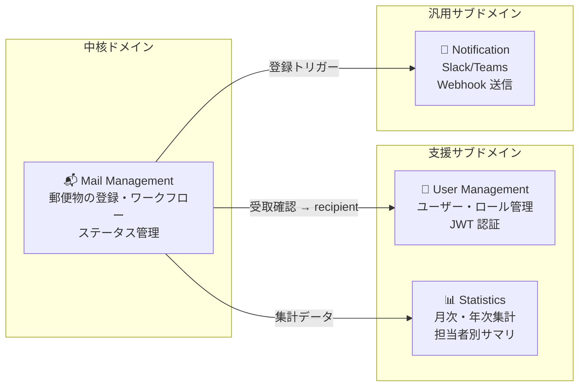
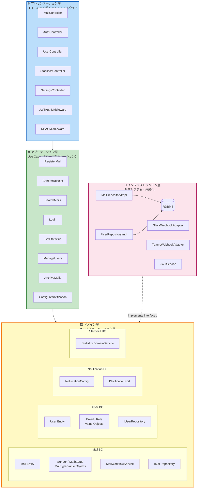
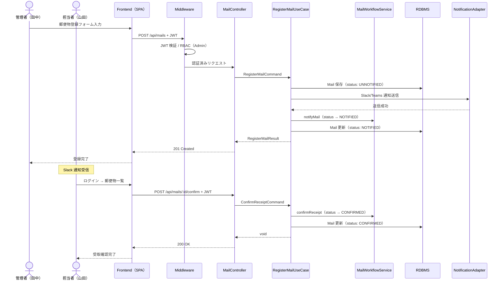

# アプリケーション設計書 — post-manager-system

> AI-DLC Inception Phase | Application Design  
> 生成日時: 2026-04-26

---

## 設計方針

| 項目 | 決定内容 |
|---|---|
| **アーキテクチャ** | DDD（Domain-Driven Design）4層アーキテクチャ |
| **フロントエンド** | SPA（Single Page Application） |
| **バックエンド API** | RESTful API |
| **認証方式** | JWT トークンベース（ステートレス） |
| **通知実装** | バックエンド内組み込み・同期処理 |
| **統計集計** | オンデマンド集計（リクエスト時に SQL 集計） |
| **リポジトリ構成** | モノレポ（frontend / backend ディレクトリ分割） |

---

## バウンデッドコンテキスト



---

## レイヤーアーキテクチャ



---

## ディレクトリ構成（モノレポ）

```
post-manager-system/
├── frontend/                    # SPA フロントエンド
│   └── src/
│       ├── pages/               # 画面コンポーネント
│       ├── features/            # 機能別モジュール
│       ├── api/                 # API クライアント
│       └── store/               # 状態管理
│
├── backend/                     # バックエンド API
│   └── src/
│       ├── presentation/        # Controllers, Middleware, DTOs
│       ├── application/         # Use Cases
│       ├── domain/              # Entities, Value Objects, Domain Services, Interfaces
│       │   ├── mail/
│       │   ├── user/
│       │   ├── notification/
│       │   └── statistics/
│       └── infrastructure/      # Repository Impl, Adapters, JWTService
│
└── docs/
    └── aidlc/                   # AI-DLC ドキュメント
```

---

## API エンドポイント一覧

| Method | Path | 責務 | 必要ロール |
|---|---|---|---|
| `POST` | `/api/auth/login` | ログイン・JWT発行 | — |
| `POST` | `/api/auth/logout` | ログアウト | 全員 |
| `POST` | `/api/auth/refresh` | トークンリフレッシュ | 全員 |
| `GET` | `/api/mails` | 郵便物一覧 | 全員 |
| `GET` | `/api/mails/search` | 郵便物検索 | 全員 |
| `POST` | `/api/mails` | 郵便物登録 | Admin |
| `PUT` | `/api/mails/:id` | 郵便物編集 | Admin |
| `DELETE` | `/api/mails/:id` | 郵便物削除 | Admin |
| `POST` | `/api/mails/:id/confirm` | 受取確認 | Handler |
| `GET` | `/api/mails/archived` | アーカイブ一覧 | Admin |
| `POST` | `/api/mails/archive` | アーカイブ実行 | Admin |
| `DELETE` | `/api/mails/archived` | アーカイブ削除 | Admin |
| `GET` | `/api/users` | ユーザー一覧 | Admin |
| `POST` | `/api/users` | ユーザー作成 | Admin |
| `PUT` | `/api/users/:id` | ユーザー更新 | Admin |
| `GET` | `/api/statistics/monthly` | 月次統計 | Admin / Viewer |
| `GET` | `/api/statistics/yearly` | 年次統計 | Admin / Viewer |
| `GET` | `/api/statistics/summary` | サマリ統計 | Admin / Viewer |
| `GET` | `/api/settings/notifications` | Webhook 設定取得 | Admin |
| `PUT` | `/api/settings/notifications` | Webhook 設定更新 | Admin |
| `POST` | `/api/settings/notifications/test` | テスト通知送信 | Admin |

---

## 主要フロー: 郵便物登録〜通知〜受取確認



---

## 参照ドキュメント

| ドキュメント | 内容 |
|---|---|
| [components.md](components.md) | コンポーネント定義・責務 |
| [component-methods.md](component-methods.md) | メソッドシグネチャ |
| [services.md](services.md) | サービス間オーケストレーション・フロー |
| [component-dependency.md](component-dependency.md) | 依存関係マトリクス・データフロー |
| [../requirements/requirements.md](../requirements/requirements.md) | 要件定義書 |
| [../user-stories/stories.md](../user-stories/stories.md) | ユーザーストーリー |
