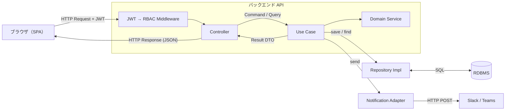

# コンポーネント依存関係 — post-manager-system

---

## 依存関係の原則（DDD）

- **依存方向**: 外側 → 内側のみ（プレゼンテーション → アプリケーション → ドメイン）
- **インフラ → ドメイン**: インターフェース（Repository / Port）を実装するが、ドメインに依存しない
- **ドメイン層**: 他のどの層にも依存しない（Pure Domain）

---

## 全体依存関係図

```mermaid
flowchart TD
    subgraph PRES["プレゼンテーション層"]
        MC["MailController"]
        AC["AuthController"]
        UC_CTRL["UserController"]
        SC["StatisticsController"]
        SEC["SettingsController"]
        JWT_MW["JWTAuthMiddleware"]
        RBAC_MW["RBACMiddleware"]
    end

    subgraph APP["アプリケーション層"]
        REG["RegisterMailUseCase"]
        LIST["GetMailListUseCase"]
        SRCH["SearchMailsUseCase"]
        UPD["UpdateMailUseCase"]
        DEL["DeleteMailUseCase"]
        CONF["ConfirmReceiptUseCase"]
        ARCH["ArchiveMailsUseCase"]
        LOGIN["LoginUseCase"]
        USERS["ManageUsersUseCase"]
        STATS["GetStatisticsUseCase"]
        NOTIF_UC["ConfigureNotificationUseCase"]
    end

    subgraph DOM["ドメイン層"]
        MAIL_E["Mail Entity"]
        USER_E["User Entity"]
        NOTIF_E["NotificationConfig Entity"]
        MWS["MailWorkflowService"]
        SDS["StatisticsDomainService"]
        MAIL_RI["IMailRepository"]
        USER_RI["IUserRepository"]
        NOTIF_PORT["INotificationPort"]
        NOTIF_CFG_RI["INotificationConfigRepository"]
    end

    subgraph INFRA["インフラストラクチャ層"]
        MAIL_IMPL["MailRepositoryImpl"]
        USER_IMPL["UserRepositoryImpl"]
        NOTIF_CFG_IMPL["NotificationConfigRepositoryImpl"]
        SLACK["SlackWebhookAdapter"]
        TEAMS["TeamsWebhookAdapter"]
        COMPOSITE["CompositeNotificationAdapter"]
        JWT_SVC["JWTService"]
        DB[("RDBMS")]
    end

    %% Presentation → Application
    MC --> REG & LIST & SRCH & UPD & DEL & CONF & ARCH
    AC --> LOGIN
    UC_CTRL --> USERS
    SC --> STATS
    SEC --> NOTIF_UC
    JWT_MW --> JWT_SVC
    JWT_MW --> USER_RI

    %% Application → Domain
    REG --> MWS & MAIL_RI & USER_RI & NOTIF_PORT
    CONF --> MWS & MAIL_RI
    LIST & SRCH & UPD & DEL & ARCH --> MAIL_RI
    LOGIN --> USER_RI & JWT_SVC
    USERS --> USER_RI
    STATS --> MAIL_RI & SDS
    NOTIF_UC --> NOTIF_CFG_RI & NOTIF_PORT

    %% Domain（internal）
    MWS --> MAIL_E
    SDS --> MAIL_E

    %% Infrastructure → Domain（implements）
    MAIL_IMPL -.->|implements| MAIL_RI
    USER_IMPL -.->|implements| USER_RI
    NOTIF_CFG_IMPL -.->|implements| NOTIF_CFG_RI
    SLACK -.->|implements| NOTIF_PORT
    TEAMS -.->|implements| NOTIF_PORT
    COMPOSITE -.->|implements| NOTIF_PORT
    COMPOSITE --> SLACK & TEAMS

    %% Infrastructure → DB
    MAIL_IMPL & USER_IMPL & NOTIF_CFG_IMPL --> DB

    style PRES fill:#BBDEFB,stroke:#1565C0,stroke-width:2px
    style APP fill:#C8E6C9,stroke:#2E7D32,stroke-width:2px
    style DOM fill:#FFF9C4,stroke:#F57F17,stroke-width:2px
    style INFRA fill:#FCE4EC,stroke:#AD1457,stroke-width:2px
```

---

## 依存マトリクス

| コンポーネント | 依存先 |
|---|---|
| `MailController` | RegisterMail / GetMailList / SearchMails / UpdateMail / DeleteMail / ConfirmReceipt / ArchiveMails UseCases |
| `RegisterMailUseCase` | `IMailRepository`, `IUserRepository`, `INotificationPort`, `MailWorkflowService` |
| `ConfirmReceiptUseCase` | `IMailRepository`, `MailWorkflowService` |
| `LoginUseCase` | `IUserRepository`, `JWTService` |
| `GetStatisticsUseCase` | `IMailRepository`, `StatisticsDomainService` |
| `JWTAuthMiddleware` | `JWTService`, `IUserRepository` |
| `MailWorkflowService` | `Mail`（Entity） |
| `StatisticsDomainService` | `Mail`（Entity） |
| `MailRepositoryImpl` | RDBMS |
| `SlackWebhookAdapter` | Slack Webhook HTTP API |
| `CompositeNotificationAdapter` | `SlackWebhookAdapter`, `TeamsWebhookAdapter` |

---

## データフロー

