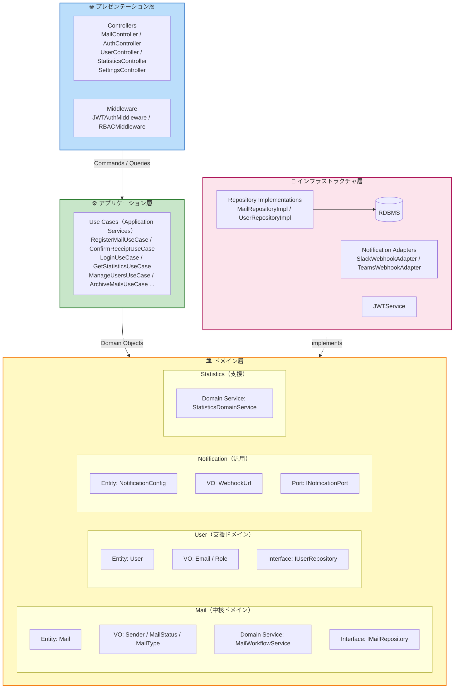

# コンポーネント定義 — post-manager-system

> AI-DLC Application Design | DDD アーキテクチャ

---

## アーキテクチャ概要

DDD（Domain-Driven Design）に基づく4層アーキテクチャ。

---

## バウンデッドコンテキスト

| コンテキスト | 種別 | 責務 |
|---|---|---|
| **Mail Management** | 中核ドメイン | 郵便物の登録・ワークフロー・ステータス管理 |
| **User Management** | 支援サブドメイン | ユーザー・ロール管理・認証 |
| **Notification** | 汎用サブドメイン | Slack/Teams Webhook 通知送信 |
| **Statistics** | 支援サブドメイン | 受信件数の月次・年次集計 |

---

## プレゼンテーション層コンポーネント

### MailController
- **責務**: 郵便物 CRUD・検索・受取確認の HTTP エンドポイント提供
- **エンドポイント**: `GET/POST/PUT/DELETE /api/mails`、`POST /api/mails/:id/confirm`
- **依存**: RegisterMailUseCase / GetMailListUseCase / UpdateMailUseCase / DeleteMailUseCase / ConfirmReceiptUseCase / SearchMailsUseCase

### AuthController
- **責務**: ログイン・ログアウト・トークンリフレッシュ
- **エンドポイント**: `POST /api/auth/login`、`POST /api/auth/logout`、`POST /api/auth/refresh`
- **依存**: LoginUseCase

### UserController
- **責務**: ユーザー管理（管理者専用）
- **エンドポイント**: `GET/POST/PUT/DELETE /api/users`
- **依存**: ManageUsersUseCase

### StatisticsController
- **責務**: 統計データの取得エンドポイント
- **エンドポイント**: `GET /api/statistics/monthly`、`GET /api/statistics/yearly`、`GET /api/statistics/summary`
- **依存**: GetStatisticsUseCase

### SettingsController
- **責務**: Webhook URL 設定・テスト送信
- **エンドポイント**: `GET/PUT /api/settings/notifications`、`POST /api/settings/notifications/test`
- **依存**: ConfigureNotificationUseCase

### JWTAuthMiddleware
- **責務**: JWT トークン検証・ユーザー情報のリクエストへの付与
- **依存**: JWTService / IUserRepository

### RBACMiddleware
- **責務**: ロールに基づくアクセス制御（管理者/担当者/閲覧者の権限チェック）
- **依存**: User.role（リクエストコンテキストから取得）

---

## アプリケーション層コンポーネント（Use Cases）

| Use Case | 責務 |
|---|---|
| `RegisterMailUseCase` | 郵便物登録 + 通知トリガー（MailWorkflowService → INotificationPort） |
| `GetMailListUseCase` | 一覧取得（ページネーション付き） |
| `SearchMailsUseCase` | 条件検索（日付・送り主・宛先・ステータス） |
| `UpdateMailUseCase` | 郵便物情報更新（管理者のみ） |
| `DeleteMailUseCase` | 郵便物削除（管理者のみ） |
| `ConfirmReceiptUseCase` | 受取確認・ステータス更新（担当者） |
| `ArchiveMailsUseCase` | 指定期間以前のデータをアーカイブ |
| `DeleteArchivedMailsUseCase` | アーカイブ済みデータの物理削除 |
| `LoginUseCase` | 認証 + JWT 発行 |
| `ManageUsersUseCase` | ユーザー作成・更新・無効化 |
| `GetStatisticsUseCase` | 月次・年次・サマリ統計の集計・返却 |
| `ConfigureNotificationUseCase` | Webhook URL の保存・テスト送信 |

---

## ドメイン層コンポーネント

### Mail（中核ドメイン）

| コンポーネント | 種別 | 責務 |
|---|---|---|
| `Mail` | Entity | 郵便物の一意識別・ライフサイクル管理 |
| `MailId` | Value Object | 郵便物の識別子（UUID） |
| `Sender` | Value Object | 送り主情報（名称・住所）の不変表現 |
| `MailStatus` | Value Object | ステータス列挙（UNNOTIFIED / NOTIFIED / CONFIRMED） |
| `MailType` | Value Object | 種別列挙（LETTER / DOCUMENT / PACKAGE / OTHER） |
| `MailWorkflowService` | Domain Service | ステータス遷移ルールの強制・ビジネス検証 |
| `IMailRepository` | Repository Interface | 永続化の抽象インターフェース |

### User（支援ドメイン）

| コンポーネント | 種別 | 責務 |
|---|---|---|
| `User` | Entity | ユーザーの一意識別・ロール・有効状態管理 |
| `UserId` | Value Object | ユーザーの識別子（UUID） |
| `Email` | Value Object | メールアドレスのバリデーション済み表現 |
| `Role` | Value Object | ロール列挙（ADMIN / HANDLER / VIEWER） |
| `IUserRepository` | Repository Interface | 永続化の抽象インターフェース |

### Notification（汎用サブドメイン）

| コンポーネント | 種別 | 責務 |
|---|---|---|
| `NotificationConfig` | Entity | Webhook URL の保存・管理 |
| `WebhookUrl` | Value Object | URL 形式バリデーション済みの Webhook URL |
| `INotificationPort` | Port（Interface） | 通知送信の抽象インターフェース（Adapter パターン） |
| `INotificationConfigRepository` | Repository Interface | 設定の永続化インターフェース |

### Statistics（支援サブドメイン）

| コンポーネント | 種別 | 責務 |
|---|---|---|
| `StatisticsDomainService` | Domain Service | 月次・年次・担当者別・種別別の集計ロジック |
| `MonthlyStats` | Value Object | 月次集計結果の不変表現 |
| `YearlyStats` | Value Object | 年次集計結果の不変表現 |

---

## インフラストラクチャ層コンポーネント

| コンポーネント | 責務 | 実装する Interface |
|---|---|---|
| `MailRepositoryImpl` | RDBMS への郵便物 CRUD 実装 | `IMailRepository` |
| `UserRepositoryImpl` | RDBMS へのユーザー CRUD 実装 | `IUserRepository` |
| `NotificationConfigRepositoryImpl` | RDBMS への設定保存実装 | `INotificationConfigRepository` |
| `SlackWebhookAdapter` | Slack Incoming Webhook への HTTP POST | `INotificationPort` |
| `TeamsWebhookAdapter` | Teams Incoming Webhook への HTTP POST | `INotificationPort` |
| `JWTService` | JWT トークンの生成・検証・リフレッシュ | — |
