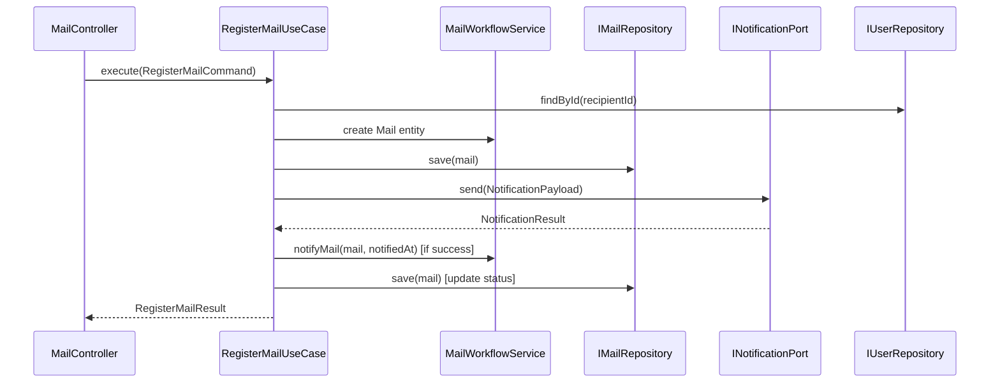
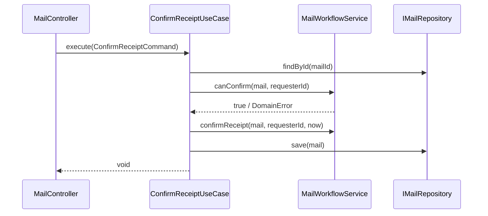
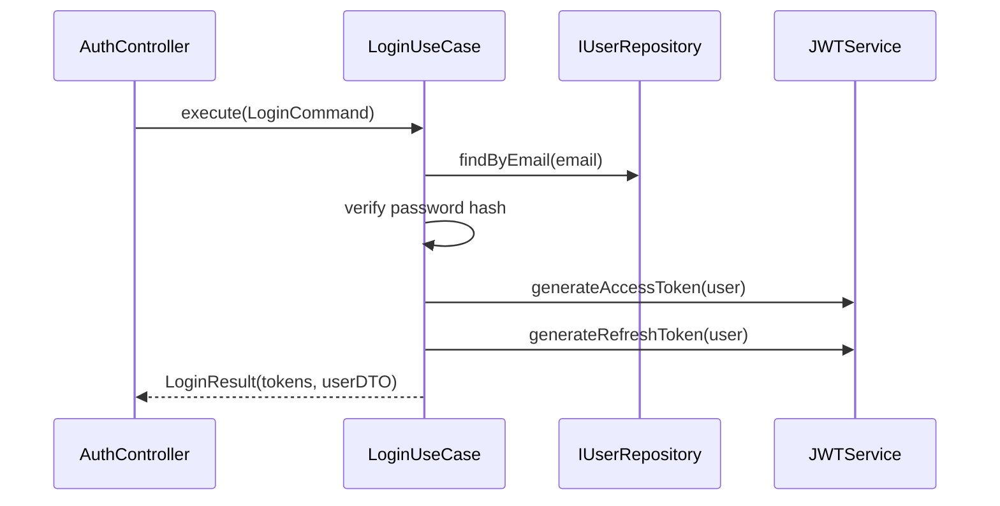
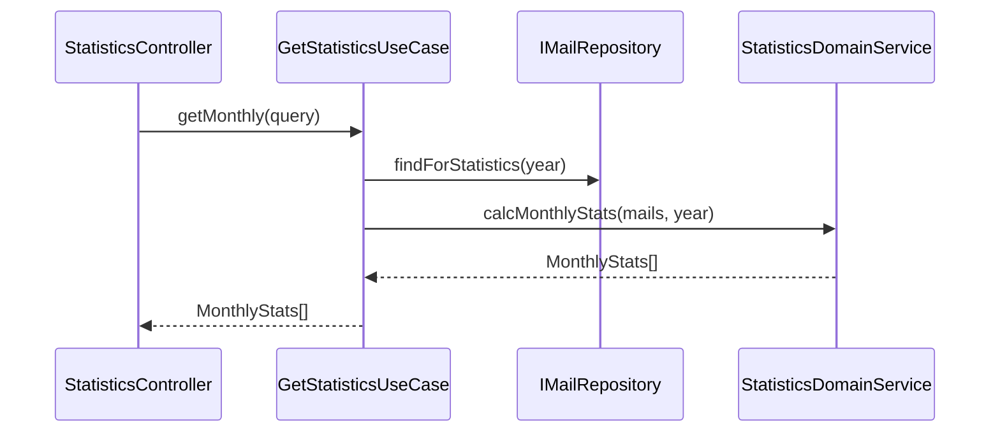
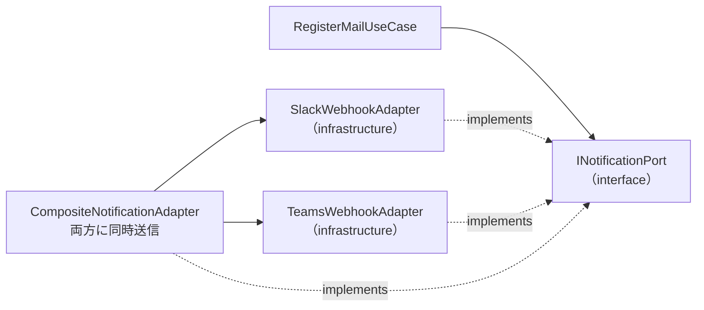

# サービス定義 — post-manager-system

> Application Layer の Use Cases と Domain Services の責務・相互作用を定義する。

---

## アプリケーションサービス（オーケストレーション）

アプリケーション層の Use Case はドメインオブジェクトを協調させるオーケストレーターとして機能する。
ビジネスルールはドメイン層が保持し、Use Case はフローの制御のみを担う。

### RegisterMailUseCase — 郵便物登録フロー

**責務**:
1. 宛先担当者の存在確認
2. `Mail` エンティティの生成（ファクトリ）
3. DB への保存
4. Slack/Teams への通知送信（同期・失敗してもロールバックしない）
5. 通知成功時はステータスを `NOTIFIED` に更新

---

### ConfirmReceiptUseCase — 受取確認フロー

---

### LoginUseCase — 認証フロー

---

### GetStatisticsUseCase — 統計取得フロー

---

## ドメインサービス

### MailWorkflowService — ステータス遷移管理

| メソッド | 責務 | ビジネスルール |
|---|---|---|
| `notifyMail(mail, notifiedAt)` | 通知済みステータスへの遷移 | 現在が UNNOTIFIED のみ許可 |
| `confirmReceipt(mail, userId, confirmedAt)` | 受取確認への遷移 | NOTIFIED または UNNOTIFIED から許可 |
| `canConfirm(mail, userId)` | 受取確認可否の検証 | CONFIRMED 済みは不可 |

### StatisticsDomainService — 集計ロジック

| メソッド | 責務 |
|---|---|
| `calcMonthlyStats(mails, year)` | 月別件数を集計（1〜12月） |
| `calcYearlyStats(mails)` | 年別件数を集計 |
| `calcSummaryByRecipient(mails, users)` | 担当者別件数ランキング |
| `calcSummaryByType(mails)` | 郵便物種別件数 |

---

## インフラストラクチャアダプター

### 通知アダプター（Adapter パターン）

`INotificationPort` インターフェースを介してドメイン層から通知先の実装を隠蔽する。

**CompositeNotificationAdapter**: Slack・Teams の両方が設定されている場合に両方に送信する複合アダプター。Use Case 側は常に `INotificationPort.send()` を呼ぶだけでよい。

---

## サービス間通信パターン

- **同期呼び出し**: Use Case → Domain Service / Repository / NotificationPort（すべて同期）
- **依存注入（DI）**: Use Case の依存（Repository / Port）はコンストラクタ注入
- **トランザクション管理**: Repository の `save()` 実行時に DB トランザクションを管理
- **エラー伝播**: Domain エラー（`DomainError`）は Use Case でキャッチし、プレゼンテーション層向けの HTTP エラーに変換
