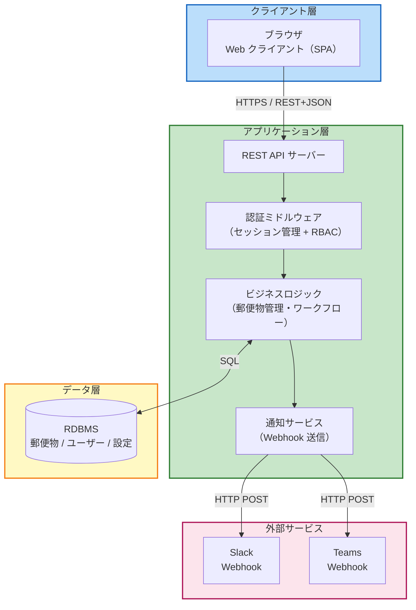

# Execution Plan — post-manager-system

> 生成日時: 2026-04-26 | AI-DLC Workflow Planning

---

## Change Impact Assessment

| 観点 | 評価 | 詳細 |
|---|---|---|
| **ユーザー影響** | Yes — 直接 | 3ロールのユーザーが直接操作するシステム全体を新規構築 |
| **構造的変更** | Yes | グリーンフィールド。フロントエンド・バックエンド・DB の3層構成 |
| **データモデル変更** | Yes | 郵便物・ユーザー・設定の新規スキーマ設計が必要 |
| **API 変更** | Yes | REST API を新規設計（CRUD + 認証 + 通知 + 統計エンドポイント） |
| **NFR 影響** | Yes | PBT 全ルール適用・認証・Webhook 連携 |

## Risk Assessment

- **リスクレベル**: **Medium**
- **理由**: 複数コンポーネントの新規構築、未定の技術スタック、PBT 要件の複雑さ
- **ロールバック難易度**: Easy（既存システムなし、いつでもリセット可）
- **テスト複雑度**: Moderate（PBT 全ルール適用、Webhook 統合テスト必要）

---

## システムアーキテクチャ（概念図）

---

## ワークフロー実行計画

```mermaid
flowchart TD
    Start(["開始"])

    subgraph INCEPTION["🔵 INCEPTION PHASE"]
        WD["Workspace Detection\n✅ COMPLETED"]
        RA["Requirements Analysis\n✅ COMPLETED"]
        US["User Stories\n✅ COMPLETED"]
        WP["Workflow Planning\n✅ COMPLETED"]
        AD["Application Design\n🟠 EXECUTE"]
        UG["Units Generation\n🟠 EXECUTE"]
    end

    subgraph CONSTRUCTION["🟢 CONSTRUCTION PHASE（per-unit）"]
        FD["Functional Design\n🟠 EXECUTE"]
        NR["NFR Requirements\n🟠 EXECUTE"]
        ND["NFR Design\n🟠 EXECUTE"]
        ID["Infrastructure Design\n⬜ SKIP"]
        CG["Code Generation\n✅ EXECUTE"]
        BT["Build and Test\n✅ EXECUTE"]
    end

    subgraph OPERATIONS["🟡 OPERATIONS PHASE"]
        OPS["Operations\n⬜ PLACEHOLDER"]
    end

    End(["完了"])

    Start --> WD --> RA --> US --> WP --> AD --> UG
    UG --> FD --> NR --> ND --> ID --> CG --> BT --> OPS --> End

    style WD fill:#4CAF50,stroke:#1B5E20,stroke-width:3px,color:#fff
    style RA fill:#4CAF50,stroke:#1B5E20,stroke-width:3px,color:#fff
    style US fill:#4CAF50,stroke:#1B5E20,stroke-width:3px,color:#fff
    style WP fill:#4CAF50,stroke:#1B5E20,stroke-width:3px,color:#fff
    style AD fill:#FFA726,stroke:#E65100,stroke-width:3px,stroke-dasharray:5 5,color:#000
    style UG fill:#FFA726,stroke:#E65100,stroke-width:3px,stroke-dasharray:5 5,color:#000
    style FD fill:#FFA726,stroke:#E65100,stroke-width:3px,stroke-dasharray:5 5,color:#000
    style NR fill:#FFA726,stroke:#E65100,stroke-width:3px,stroke-dasharray:5 5,color:#000
    style ND fill:#FFA726,stroke:#E65100,stroke-width:3px,stroke-dasharray:5 5,color:#000
    style ID fill:#BDBDBD,stroke:#424242,stroke-width:2px,stroke-dasharray:5 5,color:#000
    style CG fill:#4CAF50,stroke:#1B5E20,stroke-width:3px,color:#fff
    style BT fill:#4CAF50,stroke:#1B5E20,stroke-width:3px,color:#fff
    style OPS fill:#BDBDBD,stroke:#424242,stroke-width:2px,stroke-dasharray:5 5,color:#000
    style Start fill:#CE93D8,stroke:#6A1B9A,stroke-width:3px,color:#000
    style End fill:#CE93D8,stroke:#6A1B9A,stroke-width:3px,color:#000
```

**凡例**: ✅ 完了 / 🟠 実行予定 / ⬜ スキップ / PLACEHOLDER

---

## フェーズ別実行計画

### 🔵 INCEPTION PHASE
- [x] Workspace Detection — COMPLETED
- [x] Requirements Analysis — COMPLETED
- [x] User Stories — COMPLETED（US-01〜US-20、3ペルソナ）
- [x] Workflow Planning — COMPLETED（本ドキュメント）
- [ ] Application Design — **EXECUTE**
  - 理由: 新規システム。コンポーネント設計・データモデル・サービス層の定義が必要
- [ ] Units Generation — **EXECUTE**
  - 理由: フロントエンド / バックエンド API / 通知サービスへの分割が必要

### 🟢 CONSTRUCTION PHASE（unit ごとに繰り返し）
- [ ] Functional Design — **EXECUTE**
  - 理由: 郵便物・ユーザー・設定の新規データモデル。ワークフローのビジネスルール設計が必要
- [ ] NFR Requirements — **EXECUTE**
  - 理由: 技術スタック未選定。PBT フレームワーク（PBT-09）の選定が必要
- [ ] NFR Design — **EXECUTE**
  - 理由: PBT 拡張ルール全適用（PBT-01〜PBT-10）により、設計段階でのプロパティ特定が必要
- [ ] Infrastructure Design — **SKIP**
  - 理由: 学習目的のシンプルなローカル環境。クラウドインフラ設計は不要
- [ ] Code Generation — **EXECUTE**（常時）
- [ ] Build and Test — **EXECUTE**（常時）

### 🟡 OPERATIONS PHASE
- [ ] Operations — **PLACEHOLDER**（将来拡張）

---

## 成功基準

| 基準 | 内容 |
|---|---|
| **主目標** | 社内郵送物管理システムの学習目的での動作確認 |
| **主要成果物** | 動作する Web アプリ（登録・通知・検索・ダッシュボード） |
| **品質ゲート** | PBT-01〜PBT-10 全ルール準拠 / 受け入れ条件 US-01〜US-20 通過 |
| **スコープ外** | クラウドデプロイ、モバイル対応、OCR、複数拠点 |
