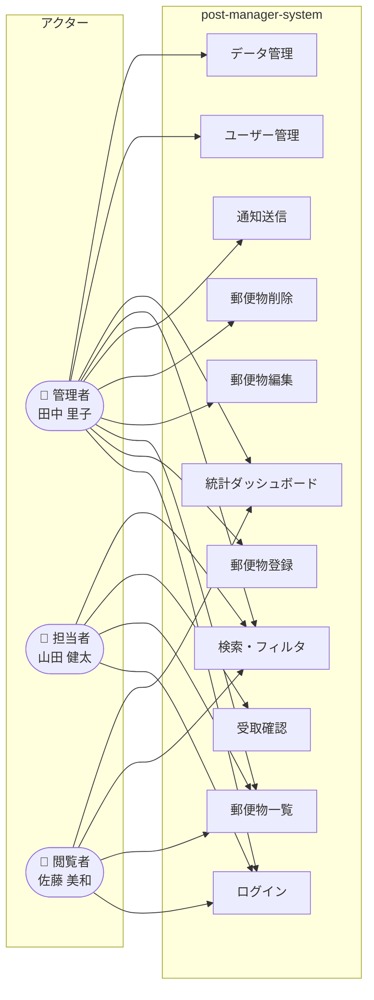

# ユーザーペルソナ — post-manager-system

> 生成日時: 2026-04-26 | AI-DLC User Stories

---

## Persona 1: 田中 里子（管理者）

| 項目 | 詳細 |
|---|---|
| **氏名** | 田中 里子（たなか さとこ） |
| **年齢** | 35歳 |
| **役職** | 総務部 主任 |
| **ロール** | 管理者 |

### 背景・特徴

総務部に5年在籍し、社内の郵便物・書類の受付業務を一手に担っている。
現在は受け取った郵便物をExcelに手入力して管理しており、担当者への通知もメールや口頭で行っている。

### ゴール

- 受信郵便物を素早く登録し、担当者への通知を自動化したい
- 誰がいつ郵便物を受け取ったか、後から追跡できるようにしたい
- 月末に受信件数のレポートを上長に提出したい

### ペインポイント

- 手作業管理のため通知漏れが発生しやすい
- 担当者が郵便物を受け取ったかどうか確認する手間がかかる
- Excelのデータ量が増えて管理が煩雑になってきた

### 技術レベル

**中程度** — PC での業務に慣れているが、開発者向けツールは使わない。
シンプルで直感的な UI を好む。

### 関連ストーリー

US-01, US-02, US-03, US-04, US-05, US-08, US-09, US-10, US-11, US-12, US-13, US-14, US-15, US-16, US-17, US-18, US-19, US-20

---

## Persona 2: 山田 健太（担当者）

| 項目 | 詳細 |
|---|---|
| **氏名** | 山田 健太（やまだ けんた） |
| **年齢** | 28歳 |
| **役職** | 営業部 担当者 |
| **ロール** | 担当者 |

### 背景・特徴

外出が多く、在席時間が不規則な営業職。Slack を主なコミュニケーション手段として使っており、
スマートフォンでの確認が多い。郵便物が届いても気づかないことがある。

### ゴール

- 自分宛ての郵便物が届いたら Slack ですぐに通知を受けたい
- 受取確認を数タップで完了させたい
- 自分に関係のない情報は見たくない

### ペインポイント

- 郵便物が届いたことを総務から口頭で言われても忘れてしまう
- 受取確認の連絡を返すのが面倒で後回しになる
- 外出中でも状況を確認したい

### 技術レベル

**高め** — スマートフォン・PC ともに使いこなせる。
Web アプリに慣れており、操作に迷うことは少ない。

### 関連ストーリー

US-01, US-03, US-06, US-07, US-11, US-12

---

## Persona 3: 佐藤 美和（閲覧者）

| 項目 | 詳細 |
|---|---|
| **氏名** | 佐藤 美和（さとう みわ） |
| **年齢** | 45歳 |
| **役職** | 営業部 部門マネージャー |
| **ロール** | 閲覧者 |

### 背景・特徴

チームメンバー数名を束ねる部門マネージャー。メンバーの業務状況の把握が主な関心事で、
システムの詳細操作より「サマリを見たい」というニーズが強い。

### ゴール

- チームの郵便物受信状況をひと目で把握したい
- 月次・年次レポートをシステムから直接確認したい
- 管理者に問い合わせなくても状況が分かるようにしたい

### ペインポイント

- 郵便物の状況を知りたいたびに総務に確認が必要
- 月末になって「先月の受信件数は？」と集計を依頼するのが申し訳ない
- システム操作は最小限にしたい（複雑なことはしたくない）

### 技術レベル

**中程度** — 業務システムは使い慣れているが、新しい UI には少し戸惑うことがある。
シンプルで分かりやすいダッシュボードを好む。

### 関連ストーリー

US-01, US-03, US-11, US-12, US-13, US-14, US-15

---

## ペルソナ × ロール マッピング

