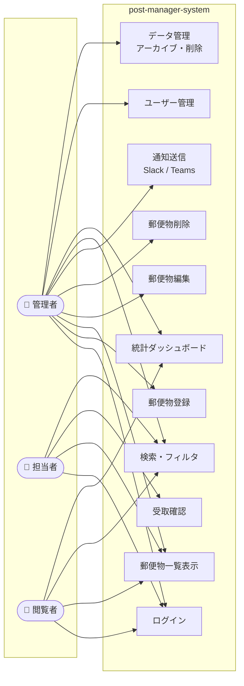
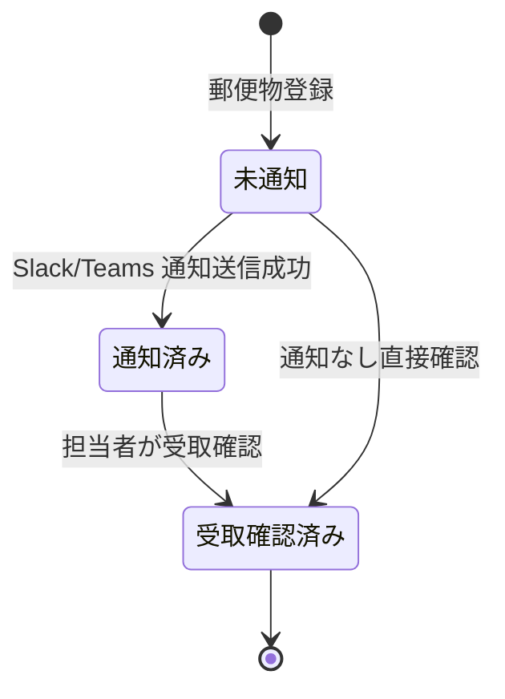

# ユーザーストーリー — post-manager-system

> 生成日時: 2026-04-26 | AI-DLC User Stories  
> ペルソナ詳細: [personas.md](personas.md)

---

## ユースケース図

---

## ストーリー一覧

### Epic: FR-03 — 認証・ユーザー管理

---

#### US-01: ログイン

**ストーリー**
> As a **ユーザー（全ロール）**, I want to **ID とパスワードでログインする**, so that **自分のロールに応じた操作権限でシステムを利用できる**.

**受け入れ条件**
- [ ] AC1: 正しい ID/パスワードでログインできる
- [ ] AC2: 誤った認証情報の場合、エラーメッセージが表示される（認証失敗の具体的理由は表示しない）
- [ ] AC3: ログイン後、自分のロールに応じたメニュー・画面が表示される
- [ ] AC4: ログアウト操作でセッションが無効化される
- [ ] AC5: 未ログイン状態での保護ページアクセスはログイン画面へリダイレクトされる

**ペルソナ**: 田中（管理者）、山田（担当者）、佐藤（閲覧者）  
**JIRA**: [PMS-14](https://ksuda1118.atlassian.net/browse/PMS-14)

---

#### US-16: ユーザー管理

**ストーリー**
> As a **管理者**, I want to **ユーザーアカウントを作成・管理する**, so that **システムへのアクセスを適切に制御できる**.

**受け入れ条件**
- [ ] AC1: 新規ユーザーを作成できる（メールアドレス・初期パスワード・ロール）
- [ ] AC2: ユーザー一覧を表示できる
- [ ] AC3: ユーザーを無効化できる（ログイン不可になる）
- [ ] AC4: 管理者ロールのユーザーのみがユーザー管理画面にアクセスできる

**ペルソナ**: 田中（管理者）  
**JIRA**: [PMS-16](https://ksuda1118.atlassian.net/browse/PMS-16)

---

#### US-17: ロール管理

**ストーリー**
> As a **管理者**, I want to **ユーザーのロールを変更する**, so that **業務変更に応じてアクセス権限を更新できる**.

**受け入れ条件**
- [ ] AC1: 管理者・担当者・閲覧者の3ロールを割り当てられる
- [ ] AC2: ロール変更は即時反映される
- [ ] AC3: 自分自身のロールは変更できない（誤操作防止）

**ペルソナ**: 田中（管理者）  
**JIRA**: [PMS-15](https://ksuda1118.atlassian.net/browse/PMS-15)

---

### Epic: FR-01 — 受信郵便物の登録・管理

---

#### US-02: 郵便物登録

**ストーリー**
> As a **管理者**, I want to **受信郵便物を登録する**, so that **受取記録を正確に管理できる**.

**受け入れ条件**
- [ ] AC1: 受取日・送り主（名称/住所）・宛先担当者・種別・メモを入力できる
- [ ] AC2: 必須項目（受取日・送り主名・宛先担当者）が未入力の場合はバリデーションエラーを表示する
- [ ] AC3: 登録後、ステータスが「未通知」に設定される
- [ ] AC4: 登録後、自動で通知処理が実行される（FR-04）
- [ ] AC5: 管理者ロールのユーザーのみ登録ボタンが表示される

**ペルソナ**: 田中（管理者）  
**JIRA**: [PMS-8](https://ksuda1118.atlassian.net/browse/PMS-8)

---

#### US-03: 郵便物一覧表示

**ストーリー**
> As a **ユーザー（全ロール）**, I want to **登録済み郵便物の一覧を見る**, so that **受信状況をひと目で把握できる**.

**受け入れ条件**
- [ ] AC1: 受取日・送り主・宛先担当者・種別・ステータスがテーブル表示される
- [ ] AC2: デフォルトで受取日の新しい順にソートされている
- [ ] AC3: ページネーションが実装されている（1ページあたり20件程度）
- [ ] AC4: ロールに応じた操作ボタンが表示される（管理者: 編集・削除、担当者: 受取確認、閲覧者: なし）

**ペルソナ**: 田中（管理者）、山田（担当者）、佐藤（閲覧者）  
**JIRA**: [PMS-9](https://ksuda1118.atlassian.net/browse/PMS-9)

---

#### US-04: 郵便物編集

**ストーリー**
> As a **管理者**, I want to **郵便物の登録情報を編集する**, so that **入力ミスを後から修正できる**.

**受け入れ条件**
- [ ] AC1: 管理者ロールのみ編集ボタンが表示される
- [ ] AC2: 全フィールドを編集できる
- [ ] AC3: 必須項目のバリデーションは登録時と同様に動作する
- [ ] AC4: 保存後、一覧に即時反映される

**ペルソナ**: 田中（管理者）  
**JIRA**: [PMS-10](https://ksuda1118.atlassian.net/browse/PMS-10)

---

#### US-05: 郵便物削除

**ストーリー**
> As a **管理者**, I want to **誤って登録した郵便物を削除する**, so that **正確なデータを維持できる**.

**受け入れ条件**
- [ ] AC1: 管理者ロールのみ削除ボタンが表示される
- [ ] AC2: 削除前に確認ダイアログが表示される
- [ ] AC3: 削除後、一覧から即時消える

**ペルソナ**: 田中（管理者）  
**JIRA**: [PMS-11](https://ksuda1118.atlassian.net/browse/PMS-11)

---

### Epic: FR-02 — 受信ワークフロー・ステータス管理

---

#### US-07: ステータス管理

**ストーリー**
> As a **管理者**, I want to **郵便物のステータスが自動的に遷移する**, so that **ワークフローの進捗を一目で確認できる**.

**ステータス遷移図**

**受け入れ条件**
- [ ] AC1: 登録直後のステータスは「未通知」
- [ ] AC2: Slack/Teams 通知成功後、ステータスが「通知済み」に自動更新される
- [ ] AC3: 担当者が受取確認後、ステータスが「受取確認済み（完了）」に更新される
- [ ] AC4: ステータスは一覧画面で色分け表示される

**ペルソナ**: 田中（管理者）、山田（担当者）  
**JIRA**: [PMS-12](https://ksuda1118.atlassian.net/browse/PMS-12)

---

#### US-06: 受取確認

**ストーリー**
> As a **担当者**, I want to **自分宛ての郵便物を受取確認する**, so that **総務に口頭で報告しなくても受取済みを記録できる**.

**受け入れ条件**
- [ ] AC1: 担当者ロールのユーザーには「受取確認」ボタンが表示される
- [ ] AC2: 確認ボタン押下後、ステータスが「受取確認済み（完了）」に更新される
- [ ] AC3: 受取確認日時が記録される
- [ ] AC4: 既に「受取確認済み」の郵便物には確認ボタンが表示されない

**ペルソナ**: 山田（担当者）  
**JIRA**: [PMS-13](https://ksuda1118.atlassian.net/browse/PMS-13)

---

### Epic: FR-04 — チャット通知連携

---

#### US-08: Slack 通知送信

**ストーリー**
> As a **管理者**, I want to **郵便物登録時に Slack へ自動通知が送信される**, so that **担当者が郵便物の到着を即座に把握できる**.

**受け入れ条件**
- [ ] AC1: 郵便物登録直後に設定済みの Slack Webhook URL へ POST リクエストが送信される
- [ ] AC2: 通知メッセージには受取日・送り主・宛先担当者名・種別が含まれる
- [ ] AC3: Webhook URL 未設定の場合は通知をスキップしてログに記録する（登録自体は成功）
- [ ] AC4: Webhook 送信失敗時も登録処理はロールバックしない

**ペルソナ**: 田中（管理者）、山田（担当者）  
**JIRA**: [PMS-17](https://ksuda1118.atlassian.net/browse/PMS-17)

---

#### US-09: Teams 通知送信

**ストーリー**
> As a **管理者**, I want to **郵便物登録時に Teams へ自動通知が送信される**, so that **Slack を使わないチームメンバーにも通知できる**.

**受け入れ条件**
- [ ] AC1: 郵便物登録直後に設定済みの Teams Webhook URL へ POST リクエストが送信される
- [ ] AC2: 通知メッセージには受取日・送り主・宛先担当者名・種別が含まれる
- [ ] AC3: Slack・Teams の両方に同時通知できる
- [ ] AC4: Webhook 送信失敗時も登録処理はロールバックしない

**ペルソナ**: 田中（管理者）  
**JIRA**: [PMS-18](https://ksuda1118.atlassian.net/browse/PMS-18)

---

#### US-10: Webhook URL 設定

**ストーリー**
> As a **管理者**, I want to **Slack/Teams の Webhook URL を管理画面で設定する**, so that **通知先チャンネルを柔軟に変更できる**.

**受け入れ条件**
- [ ] AC1: 管理画面で Slack Webhook URL と Teams Webhook URL を個別に設定できる
- [ ] AC2: URL の形式バリデーションが実施される（https:// から始まること）
- [ ] AC3: テスト送信機能で設定の正常性を確認できる
- [ ] AC4: 管理者ロールのみ設定画面にアクセスできる

**ペルソナ**: 田中（管理者）  
**JIRA**: [PMS-19](https://ksuda1118.atlassian.net/browse/PMS-19)

---

### Epic: FR-05 — 検索機能

---

#### US-11: 基本検索

**ストーリー**
> As a **ユーザー（全ロール）**, I want to **日付・送り主・宛先で郵便物を検索する**, so that **大量のデータから目的の郵便物を素早く見つけられる**.

**受け入れ条件**
- [ ] AC1: 受取日の開始日・終了日で範囲検索できる
- [ ] AC2: 送り主名の部分一致検索ができる
- [ ] AC3: 宛先担当者で絞り込める（ドロップダウン選択）
- [ ] AC4: 複数条件を組み合わせて AND 検索できる
- [ ] AC5: 検索条件をクリアするリセット機能がある

**ペルソナ**: 田中（管理者）、山田（担当者）、佐藤（閲覧者）  
**JIRA**: [PMS-20](https://ksuda1118.atlassian.net/browse/PMS-20)

---

#### US-12: ステータスフィルタ

**ストーリー**
> As a **ユーザー（全ロール）**, I want to **ステータスで郵便物を絞り込む**, so that **対応が必要な未完了の郵便物に集中できる**.

**受け入れ条件**
- [ ] AC1: 「未通知」「通知済み」「受取確認済み」の個別フィルタができる
- [ ] AC2: 「未完了（未通知＋通知済み）」でまとめて絞り込める
- [ ] AC3: フィルタは他の検索条件と組み合わせられる

**ペルソナ**: 田中（管理者）、山田（担当者）、佐藤（閲覧者）  
**JIRA**: [PMS-21](https://ksuda1118.atlassian.net/browse/PMS-21)

---

### Epic: FR-06 — 統計ダッシュボード

---

#### US-13: 月次統計グラフ

**ストーリー**
> As a **管理者または閲覧者**, I want to **月別の受信件数をグラフで確認する**, so that **郵便物受信のトレンドを視覚的に把握できる**.

**受け入れ条件**
- [ ] AC1: 当年の月別受信件数が棒グラフまたは折れ線グラフで表示される
- [ ] AC2: 年を切り替えて過去データを参照できる
- [ ] AC3: グラフの各バーにカーソルを当てると件数が表示される

**ペルソナ**: 田中（管理者）、佐藤（閲覧者）  
**JIRA**: [PMS-22](https://ksuda1118.atlassian.net/browse/PMS-22)

---

#### US-14: 年次統計集計

**ストーリー**
> As a **管理者または閲覧者**, I want to **年別の受信件数を一覧で確認する**, so that **年度ごとの業務量を比較できる**.

**受け入れ条件**
- [ ] AC1: 年別の受信件数が表形式で表示される
- [ ] AC2: 前年比の増減が表示される

**ペルソナ**: 田中（管理者）、佐藤（閲覧者）  
**JIRA**: [PMS-23](https://ksuda1118.atlassian.net/browse/PMS-23)

---

#### US-15: 担当者別・種別別サマリ

**ストーリー**
> As a **管理者または閲覧者**, I want to **担当者ごと・種別ごとの受信件数を確認する**, so that **業務負荷の分布を把握できる**.

**受け入れ条件**
- [ ] AC1: 担当者ごとの受信件数がランキング形式または表で表示される
- [ ] AC2: 郵便物種別ごとの件数が表示される
- [ ] AC3: 期間（月・年）でフィルタして絞り込める

**ペルソナ**: 田中（管理者）、佐藤（閲覧者）  
**JIRA**: [PMS-24](https://ksuda1118.atlassian.net/browse/PMS-24)

---

### Epic: FR-07 — データ保管・削除

---

#### US-18: データアーカイブ

**ストーリー**
> As a **管理者**, I want to **古い郵便物データをアーカイブする**, so that **アクティブな一覧をクリーンに保てる**.

**受け入れ条件**
- [ ] AC1: 指定した日付以前の郵便物を一括アーカイブできる
- [ ] AC2: アーカイブ済みデータは通常の一覧には表示されない
- [ ] AC3: アーカイブ済みデータは専用の一覧画面で確認できる
- [ ] AC4: アーカイブ前に対象件数を確認できる

**ペルソナ**: 田中（管理者）  
**JIRA**: [PMS-25](https://ksuda1118.atlassian.net/browse/PMS-25)

---

#### US-19: データ削除

**ストーリー**
> As a **管理者**, I want to **アーカイブ済みデータを完全削除する**, so that **保管期間を超えた不要データを除去できる**.

**受け入れ条件**
- [ ] AC1: アーカイブ済みデータのみを物理削除できる
- [ ] AC2: 削除前に確認ダイアログと対象件数が表示される
- [ ] AC3: 削除は取り消せないため、二重確認（入力確認）を実施する

**ペルソナ**: 田中（管理者）  
**JIRA**: [PMS-26](https://ksuda1118.atlassian.net/browse/PMS-26)

---

#### US-20: 保管期間設定

**ストーリー**
> As a **管理者**, I want to **データの保管期間を設定する**, so that **会社のポリシーに合わせてデータを管理できる**.

**受け入れ条件**
- [ ] AC1: 保管期間を月単位で設定できる（3ヶ月〜12ヶ月）
- [ ] AC2: 設定した保管期間がダッシュボードに表示される
- [ ] AC3: 保管期間超過データの件数が管理画面に表示される（削除の手動トリガーの判断に使う）

**ペルソナ**: 田中（管理者）  
**JIRA**: [PMS-27](https://ksuda1118.atlassian.net/browse/PMS-27)

---

## ストーリーサマリ

| ID | ストーリー | Epic | ペルソナ | JIRA |
|---|---|---|---|---|
| US-01 | ログイン | FR-03 | 全員 | PMS-14 |
| US-16 | ユーザー管理 | FR-03 | 管理者 | PMS-16 |
| US-17 | ロール管理 | FR-03 | 管理者 | PMS-15 |
| US-02 | 郵便物登録 | FR-01 | 管理者 | PMS-8 |
| US-03 | 郵便物一覧表示 | FR-01 | 全員 | PMS-9 |
| US-04 | 郵便物編集 | FR-01 | 管理者 | PMS-10 |
| US-05 | 郵便物削除 | FR-01 | 管理者 | PMS-11 |
| US-07 | ステータス管理 | FR-02 | 管理者 | PMS-12 |
| US-06 | 受取確認 | FR-02 | 担当者 | PMS-13 |
| US-08 | Slack 通知 | FR-04 | 管理者 | PMS-17 |
| US-09 | Teams 通知 | FR-04 | 管理者 | PMS-18 |
| US-10 | Webhook URL 設定 | FR-04 | 管理者 | PMS-19 |
| US-11 | 基本検索 | FR-05 | 全員 | PMS-20 |
| US-12 | ステータスフィルタ | FR-05 | 全員 | PMS-21 |
| US-13 | 月次統計グラフ | FR-06 | 管理者・閲覧者 | PMS-22 |
| US-14 | 年次統計集計 | FR-06 | 管理者・閲覧者 | PMS-23 |
| US-15 | 担当者別・種別別サマリ | FR-06 | 管理者・閲覧者 | PMS-24 |
| US-18 | データアーカイブ | FR-07 | 管理者 | PMS-25 |
| US-19 | データ削除 | FR-07 | 管理者 | PMS-26 |
| US-20 | 保管期間設定 | FR-07 | 管理者 | PMS-27 |
